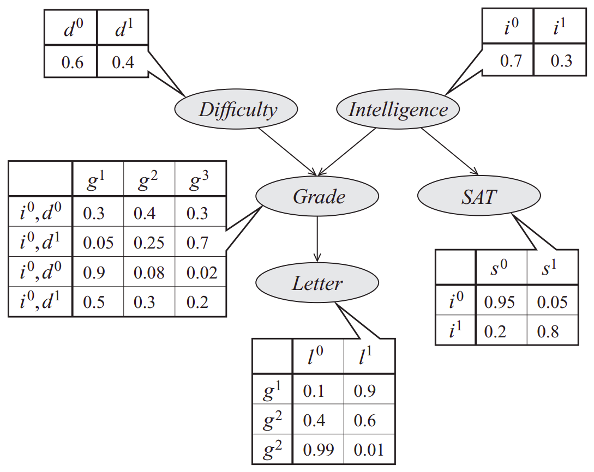
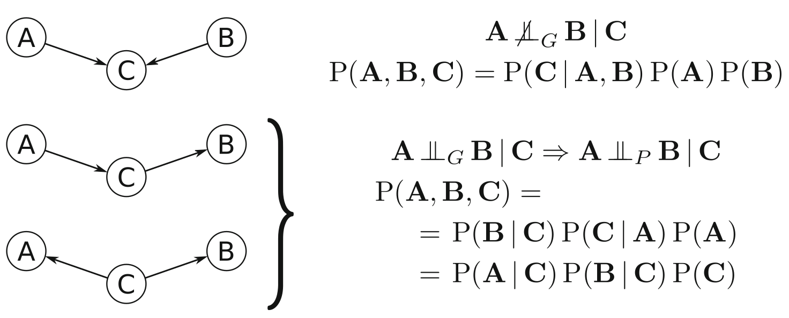

# Static Bayesian Networks
A catchy abstract comes here.

## Bayesian Networks Terminology
The probabilistic dependencies of a set of random variables $X={X_1, X_2, X_3, ..., X_n}$ can be graphically modelled as a Bayesian network in a directed acyclic graph (DAG) $G=(V,A)$ where each node $v_i \in V $ corresponds to a random variable $X_i$. Each node has a conditional probability distribution (CPD) per node, $p(x_i | x_{Pa(i)})$, specifying the variable's probability conditioned on its parents' values. We can then calculate the joint distribution by 
$$\begin{equation}
\begin{split}
  p(x_1, ..., x_n) = \prod_{i \in V} p(x_i | x_{Pa(i)}). \\
  P_X (X) = \prod_{i=1}^{p} P_{X_{i}}(X_i | \Pi_{X_{i}})  
\end{split}
(\#eq:markov)
\end{equation}$$

with $\Pi_{X_{i}}$ as the set of the parents of $X_i$. This representation is allowed through the _Markov Property_ of Bayesian networks (which follows directly from the d-separation explained below) and is a direct application of the chain rule.
For example, the joint distribution of the Bayesian network in figure \@ref(fig:baynetgrading) can then be calculated by $p(d,i,g,s,l) = p(d)p(i)p(g|i,d)p(s|i)p(l|g)$.

```{r baynetgrading, echo=FALSE, fig.align='center', fig.cap = 'Simple Bayesian Network from [MIT Lecture](http://people.csail.mit.edu/dsontag/courses/pgm12/slides/lecture2.pdf)', fig.show='hold', out.width='66%'}

```


Two variables $X$ and $Y$ are conditional independent given that event $Z$ occurs, if and only if, the fact that even $X$ occurs provides no information on the likelihood of event $Y$ occurring or not and vice versa. This can be formally written as:

$$\begin{equation}
  (X \ci Y) | Z \iff Pr(A \cap B |C) = Pr(A|C)Pr(B|C)
\end{equation}$$

We can represent the dependencies between the variables either by graphical separation ($\ci_G$) or probabilistic independence ($\ci_P$)^[Two random variables are independent, $X_1 \ci X_2$, if $p(X_1=x_1, X_2=x_2) = p(X_1=x_1)p(X_2=x_2)$ for all values $x_1 \in X_1$ and $x_2 \in X_2$.].
$\ci_G$ is induced by the absence of a particular arc. Meaning, that $X$ and $Y$ are "separated" by $Z$ and a path is absent if one of the triples along the path are inactive. An example is given on figure \@ref(fig:fundamentalconnections): A path in a serial connection or diverging connection is inactive if $C$ is observed (Markov equivalent). A path in a converging connection (v-structure) is inactive if $C$ or one of its descendants is not observed!

```{definition, label = "maps", name = "Maps"}


_Independency Map (I-map)_: A graph G is an I-map of a probabilistic dependence structure $P$ of $X$ if there is a one-to-one correspondence between the random variables in $X$ and the nodes $V$ of $G$, such that for all disjoint subsets $A, B, C$ of 
$$\begin{equation} 
  A\ci_P B|C \Leftarrow A\ci_G B|C .
  (\#eq:defimap)
\end{equation}$$
    
_Dependency Map (D-map)_: Similarly, $G$ is a D-map of $P$ of $X$ if we have
$$\begin{equation}
  A\ci_P B|C \Rightarrow A\ci_G B|C .
  (\#eq:defdmap)
\end{equation}$$
    
_Perfect Map_: Finally, $G$ is said to be a perfect map of $P$ if it is both a D-map and I-map,
$$\begin{equation}
  A\ci_P B|C \iff A\ci_G B|C ,
  (\#eq:defpmap)
\end{equation}$$
and in this case, $P$ is said to be isomorphic or faithful to G.
```


The _directed separation criterion_ is used to distinguish between the structure of the directed acyclic graph and the conditional independence relationships it represents.

```{definition, label = "d-separation", name="D-separation"}


If A, B and C are three disjoint subsets of nodes in a DAG graph G, then C is said to  *d-separate* A from B, if along every sequence of arcs between a node in A and a node in B there is a node $v$ satisfying on of the following two conditions:
  
- $v$ has converging arcs^[i.e. there are two arcs pointing to $v$ from the adjacent nodes in the path] and none of $v$ or its descendants^[i.e. the nodes that can be reached from $v$] are in C.
- $v$ is in C and does not have converging arcs.

In more formal words:
Given a graph containing vertices which correspond to a set of random variables $X$. Two vertices $X_i$ and $X_j$ are _d-connected_ given $W \subseteq X \ \{X_i, X_j \}$ in a DAG if and only if there exists a directed path between $X_i$ and $X_j$ such that every collider and no non-collider is a member of $W$. The vertices are _d-separated_ if they are not d-connected.


```


Given three nodes and two arcs, we can show the three fundamental connections in figure \@ref(fig:fundamentalconnections). In the convergent connection, node $C$ has incoming arcs from $A$ and $B$, thus violating both conditions in Definition \@ref(eq:defdmap). Therefore, $C$ does not separate $A$ and $B$. This in turn implies that $A$ and $B$ are not independent given $C$, and since $\Pi_A = { \varnothing}, \Pi_B = {\varnothing}$, and $\Pi_C = {A,B}$, we have 
$$\begin{equation}
    P(A,B,C) = P(C|A,B)P(A)P(B)
\end{equation}$$
from the Markov property introduced in Eq. \@ref(eq:markov).

```{r fundamentalconnections, echo=FALSE, fig.cap='Graphical separation, conditional independence, and probability decomposition for the three fundamental connections (top to bottom): converging connection (v-structure), serial connection, and diverging connection. From Scutari, Bayesian Network Analysis with R, fig.2.1', fig.show='hold', out.width='66%', fig.align='center'}

```

Serial and diverging connections result in equivalent factorization by repeated application of the Bayes' theorem. This structures are known as _Markov equivalent_ structures. 

A _Markov Blanket_ is the set of nodes that completely d-separates a given node from the rest of the graph:

```{definition, label = "markovblanket", name = "Markov Blanket"}
    The _Markov blanket_ of a node $A \in V$ is the minimal subset $S$ of $V$ such that
    $$\begin{equation}
        A \ci_P V-S-A | S
    \end{equation}$$
    In any Bayesian network, the Markov blanket of a node $A$ is the set of the parents of $A$, the children of $A$, and all the other nodes sharing a child with $A$.
```

> **Note**: skipped the part about moral graphs.

## Static Bayesian Networks Modelling
Fitting a Bayesian Network is called learning and is performed in two different steps corresponding to model selection and parameter estimation.

i) _structure learning_ identifies the structure of the graph of the Bayesian network with the goal to result as close as possible in a minimal I-map of the dependence structure of the data. 
The classic methods were based on 
multiple conditional independence tests that result in a set of DAGs that encompass individual conditional independence relations or 
on a bayesian approach which searches for the DAG with the highest posterior probability by applying a bayesian scoring metric to the results of a search algorithm (Spirtes 1995).
The algorithms fall in three categories: constraint-based, score-based and hybrid algorithms. Alternatively, the network structure can be built from domain knowledge and prior information on the data (white- and blacklisting specific arcs). 
ii) _parameter learning_ implements the estimation of the parameters of the global distribution by efficiently estimating the parameters of the local distributions implied by the structure obtained in the previous step.

## Constraint-Based Structure Learning Algorithms
The inductive causation algorithm (Verma and pearl 1991) provides a framework for learning the structure of Bayesian networks using conditional Independence tests and is described in \@ref{alginductivecausation}.

```{theorem, label = "alginductivecausation", name = "Inductive Causation Algorithm"}


- For each pair of variables $A$ and $B$ in $V$ search for a set $S_{AB} \subset V$ (including $S=\varnothing$) such that $A$ and $B$ are independent given $S_{AB}$ and $A,B \notin S_{AB}$.  
If there is no such a set, place an undirected arc between $A$ and $B$.  
- For each pair of non-adjacent variables $A$ and $B$ with a common neighbour $C$, check whether $C\in S_{AB}$.  
If this is not true, set the direction of the arcs $A-C$ and $C-B$ to $A \rightarrow C$ and $C \leftarrow B$.  
- Set the direction of arcs which are still undirected by applying recursively the following two rules:  
  - if $A$ is adjacent to $B$ and there is a strictly directed path from $A$ to $B$ (a path leading from $A$ to $B$   containing no undirected arcs) then set the direction of $A-B$ to $A\rightarrow B$  
  - if $A$ and $B$ are not adjacent but $A \rightarrow C$ and $C-B$, then change the latter to $C\rightarrow B$.  
- Return the resulting (completed partially) directed acyclic graph  
```

First, we backward select the saturated model with a complete graph and prune it based on statistical tests for conditional independence: We identify which pairs of variables are connected by an arc, regardless of its direction. These cannot be independent given any other subset of variables, because they cannot be d-separated. 

Second, we identify all v-structures among all the pairs of nonadjacent nodes $A$ and $B$ with a common neighbor $C$. V-structures are the only fundamental structures where two adjacent nodes are not independent conditional on the third one. If there is a subset of nodes that contains $C$ and d-separates $A$ and $B$, the three nodes are part of a v-structure centered on $C$. 
Now, we know the skeleton and the v-structures of the network.

Third, we identify compelled arcs and orient them recursively to obtain the completed partially DAG (CPDAG) describing the equivalence class identified by the previous steps.

The first two steps cannot be applied to any real-world problem because of its exponential number of possible conditional independence relationship. This led to the development of improved algorithms: _PC_ (spirtes et al, 2001), _Grow-Shrink Markov blanket_ (Margaritis, 2003), _Incremental Association_ (Tsamardinos et al., 2003) and variations of those.
They all (except PC) first learn the Markov blanket of each node in the network which simplifies the identification of neighbors of each node and hence also the computational complexity.

### PC
Original paper about PC: Spirtes, Glymour, and Scheines (1993)
Is the well established, unsupervised method if no selection bias, no latent variables and only acyclic relations exist.
The causal relations are detected through multiple conditional independence tests. The accuracy depends on how the type I error rate $\alpha$ is set a priori. Different methods were proposed on how to tune this hyperparameter automatically:
Schwarz et al 1978 choose the model with the lowest BIC score by assuming a parametric model. 
Rathu et al, 2018 proposed a computationally intensive, non-parametric algorithm StARS which runs PC on multiple bootstrapped draws and outputs the $\alpha$ maximizing graph stability.
OCTs uses cross-validation to evaluate the predictive accuracy of Markov boundaries which have to be unique (Biza et al., 2020). During the cross-validation step of OCTs an other parameter $\alpha$ is introduced.
AutoPC runs PC twice for each $\alpha$ of a finite, user-specified set of reasonable choices of $\alpha$. The second run is a variant of PC which conditions on subsets of parents from the partially DAG of the first run which will be less time intensive than the first run. Its accuracy is outstanding and the computational time is on the level of BIC for an increasing number of vertices (Strobl 2020). 


## Score-Based Structure Learning Algorithms
They are also known as _search-and-score algorithms_ are a general heuristic optimization technique. Each candidate network is assigned a network score reflecting its goodness of fit, which the algorithm then attempts to maximize. There are three main classes of such algorithms:
_Greedy search_ algorithms (i.e. hill-climbing with random restarts or tabu search) explore the search space starting from a network structure (usually the empty graph and adding, deleting or reversing one arc at a time until the score can no longer be improved.

```{theorem, label = "alghc", name = "Hill-Climbing Algorithm"}


- Choose a network structure $G$ over $V$ which is usually empty (but not necessarily).
  - Compute the score of $G$, denoted as $Score_G = Score(G)$.
  - Set $maxscore = Score_G$
  - While $maxscore$ increases:
    - for every possible arc addition, deletion or reversal not resulting in a cyclic network:
      - compute the score of the modified network $G*$, $Score_{G*} = Score(G*)$:
      - if $Score_{G*} > Score_G$, set $G = G*$ and $Score_G = Score_{G*}$
  - update $maxscore$ with the new value of $Score_G$.
- Return the directed acyclic graph $G$.
```

_Genetic_ algorithms, mimic natural evolution through iteratively selecting the "fittest" model and the hybridization of their characteristics. The search space is explored through combining the structure of two networks (crossover) and introducing random alterations (mutation stochastic operators).  

_Simulated annealing_ performs a stochastic local search by accepting changes that increase the network score and allowing changes that decrease it with a probability inversely proportional to the score decrease. 
Russel and Norvig (2009) provide comprehensive review of the heuristics.

## Hybrid Structure Learning Algorithms
They combine constraint-based and score-based algorithms to offset their weaknesses and produce reliable network structures in many situations. Well known members of this family are _Sparse Candidate algorithm_ by Friedman et al (1999b) and _Max-Min Hill-Climbing algorithm_ by Tsamardinos et al (2006). 

```{theorem, label = "algsparsecan", name = "Sparse Candidate Algorithm"}


- Choose a network structure $G$ over $V$ which is usually empty (but not necessarily).
  - While not converged:
    - **restrict:** select a set $C_i$ of candidate parents for each node $X_i \in V$, which must include the parents of $X_i$ in $G$;
    - **maximize:** find the network structure $G*$ that maximizes $Score(G*)$ among the networks in which the parents of each node $X_i$ are included in the corresponding set $C_i$,
    - set $G = G*$
- Return the directed acyclic graph G
```

These algorithms basically have two steps: (i) in the first *restrict* state, the candidate set for the parents of each node $X_i$ is reduced from the whole node set $V$ to a smaller set $C_i \subset V$ of nodes whose behavior has been shown to be related in some way to that of $X_i$ resulting in a smaller and more regular search space. Then the network is searched that (ii) *maximizes* a given score function, subject to the constraints imposed by the $C_i$ sets.

In the Sparse Candidate Algorithm the two steps are repeated until there is no change in the network or the network score does not improve anymore. In the Max-Min Hill-Climbing algorithm, restrict and maximize are performed only once.

## Choosing Distributions, Conditional Independence Tests, and Network Scores
There are two common cases for global and local distribution functions:

- _Multinomial variables:_ are used for categorical/discrete data sets (discrete case). Global and local distribution are multinomial. Local distributions are represented in conditional probability tables (CPTs). This is the most common assumption and corresponding Bayesian networks are referred to as discrete Bayesian networks.
- _Multivariate normal variables:_ are used for continuous data sets (continuous case). The global distribution is multivariate normal, whereas the local distributions are univariate normal random variables linked by linear constraints.  The corresponding Bayesian networks are referred to as Gaussian Bayesian networks.

The choice of the global and local distributions determines which conditional independence tests and which network scores can be used to learn the structure of the Bayesian network.
For discrete data, conditional independence tests and network scores are functions of the CPTs implied by the graphical structure of the network through the observed frequencies $\{ n_{ijk}, i = 1, ..., R, j = 1, ..., C, k=1, ..., L \}$ for the random variables $X$ and $Y$ and all the configurations of the conditioning variables $Z$. 
Two common conditional Independence tests are:

- _Mutual Information_ which is an information-theoretic distance measure:
    $$\begin{equation}
        MI(X,Y|Z) = \sum_{i=1}^{R} \sum_{j=1}^{C} \sum_{k=1}^{L} \frac{n_{ijk}}{n} log\frac{n_{ijk}n_{++k}}{n_{i+k}n_{+jk}}
    \end{equation}$$
    and is proportional by a factor $2n$ ($n$: sample size) to the log-likelihood ratio test $G^2$ and it is related to the deviance of the tested models.
- _Pearson's $\chi^2$ _ test for contingency tables,
    $$\begin{equation}
        \chi^{2}(X,Y|Z) = \sum_{i=1}^{R} \sum_{j=1}^{C} \sum_{k=1}^{L} \frac{(n_{ijk} - m_{ijk})^2}{m_{ijk}}, \text{where } m_{ijk}=\frac{n_{i+k}n_{+jk}}{n_{++k}}
    \end{equation}$$
In both cases, there are two ways to test the null hypothesis of independence. Either bey asymptotic $\chi^{2}_{(R-1)(C-1)L}$ distribution or the Monte Carlo permutation approach (Edwards (2000)). Alternatively, Fisher's exact test and the shrinkage estimator for the mutual information defined by Hausser and Strimmer (2009) are possible.

Common network scores are the _Bayesian Dirichlet equivalent (BDe)_ and the _Bayesian information criterion (BIC)_. BDe associates the posterior density with a uniform prior over both the space of the network structures and the parameters of each local distribution. The BIC is a penalized likelihood score defined as:
$$\begin{equation}
    BIC=\sum_{i=1}^{n} log P_{X_i}(X_i | \Pi_{X_i}) - \frac{d}{2}log(n)
\end{equation}$$
with $d$ being the number of parameters of the global distribution. The more parameters are included in the model, the more likely it will overfit and this is penalized by a large BIC. 

Conditional independence tests and network score in the continuous case are functions of the partial correlation coefficients $\rho_{XY|Z}$ of $X$ and $Y$ given $Z$. Two common conditional independence tests are the exact $t$ test for Pearson's correlation coefficient:
$$\begin{equation}
    t(X,Y|Z) = \rho_{XY|Z} \sqrt{\frac{n-2}{q- \rho_{XY|Z}^{2}}}
\end{equation}$$
distributed as a Student's $t$ with $n-|Z|-2$ degrees of freedom and _Fisher's Z_ test which is a transformation of the linear correlation coefficient with an asymptotic normal distribution defined as 
$$\begin{equation}
    Z(X,Y|Z) = \frac{\sqrt{n-|Z|-3}}{2}log\frac{1+\rho_{XY|Z}}{1-\rho_{XY|Z}}.
\end{equation}$$
An other option would be the mutual information test defined in Kullback (1968) which is proportional to the corresponding log-likelihood ratio test.

Common network scores are again BIC but this time defined as
$$\begin{equation}
    BIC=\sum_{i=1}^{n} log f_{X_i}(X_i | \Pi_{X_i}) - \frac{d}{2}log(n)
\end{equation}$$
and the _Bayesian Gaussian equivalent (BGe)_ score, the Wishart posterior density of the network associated with a uniform prior over both the space of the network structures and of the parameters of the local distributions.

## Parameter Learning
Given the (learned) structure of the network the task of estimating and updating the parameters of the global distribution is greatly simplified by the application of the Markov property.

In dynamic programming the _Curse of dimensionality_ is a phenomena that can be observed when the dimensionality increases, the volume of space increases so fast, that the data becomes sparse. In the context of parameter learning, we observe this phenomena because each local distribution has a comparatively small number of parameters to estimate from the sample and estimates are more accurate due to the better ratio between the size of parameter space and the sample size. There exist two approaches to estimate the parameters: _maximum likelihood estimation_ and _Bayesian estimation}.

The number of parameters of the global distribution is the sum of the number of parameters of the local distributions. To uniquely identify the global distribution not all parameters of the local distributions are required. Because of the conditional independence relationships are encoded in the network structure, large parts of the parameters space are fixed. 
For example, in Gaussian Bayesian networks, partial correlation coefficients involving (conditionally) independent variables are equal to zero by definition, and joint frequencies factorise into marginal ones in multinomial distributions.

It is, however, common that the sample sizes are much smaller than the number of variables included in the model (i.e. in high-throughput biological data: few ten or hundred observations and thousands of genes). This setting is called "small $n$, large $p$", estimates have a high variability unless particular care is taken in both structure and parameter learnings.

## Discretization
To facilitate learning Bayesian networks from mixed data, we can convert all continuous variables to discrete ones ( _discretization_ or _binning_ ). This completely sidesteps the problem of defining a probabilistic model for the data. 
Discretization is also applied when continuous data violates normality (skewness, heavy tailes, etc.). The discretization intervals (bins) can be choosen in different ways. Often it makes sense to use prior knowledge on the data to define the intervals for each variable to different real-world scenarios (pollutant concentration: absent, dangerous, lethal; age classes: child, adult elderly). This is however not always possible and heuristical methods (Sturges, Freedman-Diaconis or Scott rules) offer a feasible possibility. 
To reduce information loss and balance the accuracy, the number of intervals and boundaries should be choosen one variable at a time and beofre the network structure has been learned (kohavi and Sahami, 1996, Hertemink 2001).
We can also perform learning and discretization iteratively until no improvement is made (Friedman and Goldszmidt, 1996).
All these straategies represent different trade-offs between teh accuracy of the discrerte representation of the original data and the computational efficiency of the tranformation.

